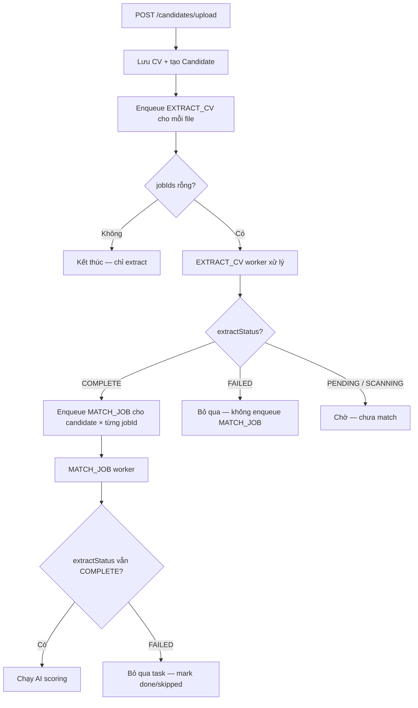

# API Contract — Phase 2 (Interview Process)

> Bổ sung cho [api-contract.md](../api-contract.md). Base URL: `http://localhost:8081/v1` (development).
>
> Phase 2 scope: Upload CV (+ optional match queue), Start Matching CV (`POST /matches/trigger`), `pipelineStatus` trên match, CRUD Interview Process, HR contact (6.1).

---

## 1. Thay đổi so với Phase 1

| Hạng mục | Phase 1 | Phase 2 |
|----------|---------|---------|
| `POST /candidates/upload` | Chỉ `files` → `EXTRACT_CV` | Thêm `jobIds[]`, `source`; response `UploadCandidatesResponse` |
| `POST /matches/trigger` | `{ jobId, candidateIds }` | Thêm `{ jobIds[], candidateIds[] }`; response `TriggerMatchResponse` |
| Matching worker | — | Bỏ qua CV `extractStatus = FAILED` (§2.1.1) |
| `CVMatch` | Không có pipeline | Thêm `pipelineStatus`, `processId?` |
| Interview Process | Không có | Module `/interview-processes` (CRUD + contact + reject) |
| Match ranking (FE) | Thứ tự API | Sort client `score DESC`; BE có thể `sort=score,desc` |

---

## 2. Upload CV + Matching Queue (HR)

### 2.1. Luồng xử lý (Backend)



| Bước | Mô tả |
|------|-------|
| 1 | Nhận multipart: `files` (bắt buộc), `jobIds` (tuỳ chọn, có thể rỗng) |
| 2 | Tạo một `Candidate` record / file; `extractStatus = PENDING` |
| 3 | Enqueue `EXTRACT_CV` vào `queue_tasks` cho mỗi candidate |
| 4 | Nếu `jobIds` **không rỗng**: sau khi extract **`COMPLETE`**, worker enqueue `MATCH_JOB` với `{ candidateId, jobId }` cho **mỗi** job đã chọn |
| 5 | Nếu extract **`FAILED`**: **không** enqueue `MATCH_JOB` cho candidate đó (bỏ qua toàn bộ cặp candidate × job của file lỗi) |
| 6 | Nếu `jobIds` **rỗng / không gửi**: không enqueue matching |

### 2.1.1. Quy tắc server — bỏ qua CV extract FAILED khi matching

Áp dụng cho **mọi** luồng chạy `MATCH_JOB` (upload kèm `jobIds`, `POST /matches/trigger`, match-all theo job, v.v.):

| Điều kiện | Hành vi server |
|-----------|----------------|
| `candidate.extractStatus === 'FAILED'` | **Bỏ qua** — không gọi AI matching; không tạo / cập nhật bản ghi `CVMatch` |
| `candidate.extractStatus` là `PENDING` hoặc `SCANNING` | **Không chạy match** — hoãn enqueue `MATCH_JOB` cho đến khi extract `COMPLETE`, hoặc worker skip task và retry sau (tùy implementation queue) |
| `candidate.extractStatus === 'COMPLETE'` | Cho phép chạy matching bình thường |
| Task `MATCH_JOB` đã trong queue nhưng lúc worker claim candidate đã `FAILED` | **Bỏ qua** task (không fail cả queue); đánh dấu task `done` / `skipped` với log (không throw) |

**Lý do:** CV extract failed không có dữ liệu đủ tin cậy để scoring; tránh lỗi worker và kết quả match sai.

**Ghi chú triển khai (BE):**

```text
// Pseudocode — MATCH_JOB worker
if (candidate.extractStatus != COMPLETE) {
  if (candidate.extractStatus == FAILED) {
    skipTask(SKIP_REASON_EXTRACT_FAILED);
    return;
  }
  // PENDING / SCANNING: reschedule or leave for later
  return;
}
runMatching(candidate, job);
```

Job `CLOSED` / `ARCHIVED` → `400` khi upload, hoặc bỏ qua khi worker xử lý (thống nhất với BE).

### 2.2. Request — POST `/candidates/upload`

**Content-Type:** `multipart/form-data`

| Field | Type | Required | Mô tả |
|-------|------|----------|-------|
| `files` | `File[]` | ✓ | Một hoặc nhiều PDF; cùng field name lặp lại |
| `jobIds` | `number[]` | | ID job Active; field lặp `jobIds=1&jobIds=2` hoặc tương đương |
| `source` | `string` | | VD: `HR_UPLOAD`, `PUBLIC_PORTAL` |

**Validation:** giữ nguyên Phase 1 — PDF only, max 10MB/file, 100MB/request.

**Example (cURL):**

```bash
curl -X POST http://localhost:8081/v1/candidates/upload \
  -H "Authorization: Bearer <token>" \
  -F "files=@cv-a.pdf" \
  -F "files=@cv-b.pdf" \
  -F "jobIds=1" \
  -F "jobIds=3" \
  -F "source=HR_UPLOAD"
```

### 2.3. Response — `UploadCandidatesResponse`

```json
{
  "success": true,
  "message": "SUCCESS",
  "data": {
    "candidates": [
      {
        "id": 42,
        "name": "Processing…",
        "email": "",
        "cvFileName": "cv-a.pdf",
        "extractStatus": "PENDING",
        "employmentTag": "CHUA_NHAN_VIEC",
        "uploadedAt": "2026-05-30T10:00:00+07:00"
      }
    ],
    "extractTasksQueued": 2,
    "matchTasksQueued": 4
  }
}
```

| Field | Type | Mô tả |
|-------|------|-------|
| `candidates` | `Candidate[]` | Một phần tử / file |
| `extractTasksQueued` | number | Số task `EXTRACT_CV` đã enqueue (= số file) |
| `matchTasksQueued` | number | Số task `MATCH_JOB` **dự kiến** enqueue sau extract thành công; `0` nếu không có `jobIds` |

**Công thức ước tính (khi có jobIds, response ngay sau upload):**

```
matchTasksQueued = files.length × jobIds.length
```

> Đây là **số tối đa** nếu mọi CV extract `COMPLETE`. Số task thực tế enqueue có thể **nhỏ hơn** khi một hoặc nhiều CV extract `FAILED` (server bỏ qua — xem §2.1.1).

> FE vẫn chấp nhận response cũ `Candidate[]` (mảng thuần) để tương thích BE chưa nâng cấp.

### 2.4. Errors

| HTTP | errorCode | Khi nào |
|------|-----------|---------|
| 400 | `NO_FILES` | Không có file |
| 400 | `INVALID_FILE_TYPE` | Không phải PDF |
| 400 | `FILE_TOO_LARGE` | Vượt 10MB/file hoặc 100MB tổng |
| 400 | `INVALID_JOB_ID` | jobId không tồn tại hoặc không ACTIVE |
| 422 | `EMPTY_FILE` | File rỗng |

### 2.5. `queue_tasks.metadata` (bổ sung)

| `taskType` | Khi enqueue | `metadata` |
|------------|-------------|------------|
| `EXTRACT_CV` | Ngay sau upload | `{ "candidateId": 42 }` |
| `MATCH_JOB` | Sau extract **COMPLETE** (nếu có jobIds) | `{ "candidateId": 42, "jobId": 1 }` |

**Kết quả worker `MATCH_JOB` khi skip (extract FAILED):**

| Field gợi ý | Giá trị |
|-------------|---------|
| `status` | `done` hoặc `skipped` (không `failed` — không retry vô ích) |
| `metadata.skipReason` | `EXTRACT_FAILED` |
| `metadata.candidateId` / `jobId` | Giữ nguyên từ payload |

Không tạo row trong `cv_matches` khi skip.

### 2.6. POST `/matches/trigger` — Start Matching CV (HR)

Dùng từ màn **Matching CV** — chọn nhiều ứng viên (extract `COMPLETE`) và nhiều job → enqueue `MATCH_JOB` cho mỗi cặp `(candidateId, jobId)`.

**Request (Phase 2 — khuyến nghị):**

```json
{
  "jobIds": [1, 3],
  "candidateIds": [6, 8, 10]
}
```

| Field | Type | Required | Mô tả |
|-------|------|----------|-------|
| `jobIds` | `number[]` | ✓ | Ít nhất 1 job `ACTIVE` |
| `candidateIds` | `number[]` | ✓ | Ít nhất 1 candidate |

**Legacy (một job):** `{ "jobId": 1, "candidateIds": [6, 8] }` — BE vẫn có thể hỗ trợ; FE ưu tiên `jobIds[]`.

**Response — `TriggerMatchResponse`:**

```json
{
  "success": true,
  "message": "SUCCESS",
  "data": {
    "matchTasksQueued": 6,
    "skippedCandidateIds": [9]
  }
}
```

| Field | Type | Mô tả |
|-------|------|-------|
| `matchTasksQueued` | number | Số task `MATCH_JOB` thực sự đã enqueue |
| `skippedCandidateIds` | `number[]` | ID bị bỏ qua (extract ≠ `COMPLETE`, thường `FAILED`) |

**Công thức tối đa:**

```
matchTasksQueued <= candidateIds.length × jobIds.length
```

| Trường hợp | Server |
|------------|--------|
| `candidateIds` có id extract `FAILED` / `PENDING` / `SCANNING` | Bỏ qua id đó; ghi vào `skippedCandidateIds` |
| Tất cả id đều không eligible | `200` + `matchTasksQueued: 0` |
| Mọi id `COMPLETE` | Enqueue `MATCH_JOB` cho từng `(candidateId, jobId)` |

> Cùng logic §2.1.1 — worker và lúc enqueue đều không match CV extract failed.

**Example (cURL):**

```bash
curl -X POST http://localhost:8081/v1/matches/trigger \
  -H "Content-Type: application/json" \
  -H "Authorization: Bearer <token>" \
  -d '{"jobIds":[1,3],"candidateIds":[6,8,10]}'
```

---

## 3. Data Models

### 3.1. PipelineStatus

```typescript
type PipelineStatus =
  | 'NONE'
  | 'SHORTLISTED'
  | 'CONTACTED'
  | 'INTERVIEW_SCHEDULED'   // Phase 3 — read-only trên FE Phase 2
  | 'INTERVIEW_DONE'        // Phase 3
  | 'OFFER'                 // Phase 4
  | 'ONBOARDED'             // Phase 4
  | 'REJECTED';
```

**Phase 2 transitions hợp lệ:**

```
NONE → SHORTLISTED          (khi tạo Interview Process)
SHORTLISTED → CONTACTED     (khi POST .../contact)
SHORTLISTED | CONTACTED → REJECTED   (optional, POST .../reject)
```

### 3.2. ContactStatus

```typescript
type ContactStatus = 'NOT_CONTACTED' | 'CONTACTED';
```

### 3.3. CVMatch (cập nhật)

```json
{
  "id": 1,
  "candidateId": 6,
  "candidateName": "Nguyễn Minh Đức",
  "jobId": 1,
  "jobTitle": "Senior Frontend Developer",
  "score": 92,
  "details": {
    "skillMatch": 95,
    "experienceMatch": 88,
    "educationMatch": 90
  },
  "pipelineStatus": "NONE",
  "processId": null,
  "createdAt": "2026-05-28T10:00:00+07:00"
}
```

| Field | Type | Mô tả |
|-------|------|-------|
| `pipelineStatus` | `PipelineStatus` | Trạng thái pipeline trên match; sync với process |
| `processId` | `number \| null` | ID process active; `null` nếu chưa tạo |

### 3.4. InterviewProcess

```json
{
  "id": 101,
  "matchId": 1,
  "candidateId": 6,
  "candidateName": "Nguyễn Minh Đức",
  "jobId": 1,
  "jobTitle": "Senior Frontend Developer",
  "matchScore": 92,
  "status": "SHORTLISTED",
  "contactStatus": "NOT_CONTACTED",
  "contactNote": null,
  "contactedAt": null,
  "assignedHr": "Trần Thị Lan",
  "notes": "Ứng viên nổi bật, ưu tiên phỏng vấn",
  "rejectReason": null,
  "createdAt": "2026-05-29T10:30:00+07:00",
  "updatedAt": "2026-05-29T10:30:00+07:00"
}
```

| Field | Type | Required | Mô tả |
|-------|------|----------|-------|
| `id` | number | ✓ | PK |
| `matchId` | number | ✓ | FK → cv_matches |
| `candidateId` | number | ✓ | Denormalized |
| `candidateName` | string | ✓ | Denormalized |
| `jobId` | number | ✓ | Denormalized |
| `jobTitle` | string | ✓ | Denormalized |
| `matchScore` | number | ✓ | Snapshot score lúc tạo |
| `status` | `PipelineStatus` | ✓ | Trạng thái hiện tại |
| `contactStatus` | `ContactStatus` | ✓ | Chi tiết bước 6.1 |
| `contactNote` | string | | Ghi chú liên hệ |
| `contactedAt` | ISO8601 | | Set server-side khi `CONTACTED` |
| `assignedHr` | string | | Tên HR phụ trách (text) |
| `notes` | string | | Ghi chú chung |
| `rejectReason` | string | | Chỉ khi `status = REJECTED` |
| `createdAt` | ISO8601 | ✓ | |
| `updatedAt` | ISO8601 | ✓ | |

### 3.5. ProcessActivity

```json
{
  "id": 1001,
  "processId": 101,
  "action": "CONTACT_MARKED",
  "fromStatus": "SHORTLISTED",
  "toStatus": "CONTACTED",
  "note": "Đã gọi điện, ứng viên đồng ý phỏng vấn tuần sau",
  "performedBy": "Trần Thị Lan",
  "createdAt": "2026-05-30T14:00:00+07:00"
}
```

| `action` | Mô tả |
|----------|-------|
| `CREATED` | Tạo process từ match |
| `METADATA_UPDATED` | PATCH assignedHr / notes |
| `CONTACT_MARKED` | Cập nhật contact status |
| `REJECTED` | Reject process |
| `STATUS_CHANGED` | Generic (dùng cho Phase 3+) |

### 3.6. InterviewProcessDetail

Response của `GET /interview-processes/:id`:

```json
{
  "process": { /* InterviewProcess */ },
  "activities": [ /* ProcessActivity[] */ ]
}
```

### 3.7. Paginated list

```json
{
  "items": [ /* InterviewProcess[] */ ],
  "total": 42,
  "page": 0,
  "size": 20
}
```

### 3.8. UploadCandidatesResponse

```typescript
interface UploadCandidatesResponse {
  candidates: Candidate[];
  extractTasksQueued: number;
  matchTasksQueued: number;  // ước tính tối đa; thực tế có thể giảm nếu extract FAILED
}
```

### 3.9. TriggerMatchRequest / TriggerMatchResponse

```typescript
interface TriggerMatchRequest {
  jobIds: number[];
  candidateIds: number[];
}

interface TriggerMatchResponse {
  matchTasksQueued: number;
  skippedCandidateIds: number[];
}
```

---

## 4. Endpoints

### 4.1. Matches (cập nhật)

> **Worker `MATCH_JOB`:** luôn kiểm tra `candidate.extractStatus` trước khi scoring. `FAILED` → bỏ qua (§2.1.1). Không áp dụng cho `EXTRACT_CV`.

#### GET `/matches`

Không đổi path. Response item bổ sung `pipelineStatus`, `processId`.

**Query params (optional, Phase 2):**

| Param | Type | Mô tả |
|-------|------|-------|
| `sort` | string | `score,desc` (default) hoặc `createdAt,desc` |
| `pipelineStatus` | string | Filter theo status |

**Response:** `CodeResponse<CVMatch[]>`

**UI — Start Interview:** mỗi dòng match có `pipelineStatus = NONE` và chưa có `processId` → nút **Start Interview** → `POST /interview-processes` với `{ "matchId" }` → redirect chi tiết process.

#### GET `/matches/job/:jobId`

Giống trên, filter theo job.

#### GET `/matches/candidate/:candidateId`

Giống trên, filter theo candidate.

#### POST `/matches/trigger` — Start Matching CV

Chi tiết đầy đủ: **§2.6** (request `jobIds` + `candidateIds`, response, skip extract FAILED).

**UI:** màn `/hr/matches` — nút **Start Matching CV**.

---

#### PATCH `/matches/:matchId/pipeline-status` *(optional)*

Chỉ shortlist tag, không tạo process. FE Phase 2 **ưu tiên POST /interview-processes**.

**Request:**

```json
{
  "pipelineStatus": "SHORTLISTED"
}
```

**Response:** `CodeResponse<CVMatch>`

**Errors:**

| HTTP | errorCode | Khi nào |
|------|-----------|---------|
| 400 | `INVALID_STATUS_TRANSITION` | Chuyển status không hợp lệ |
| 404 | `MATCH_NOT_FOUND` | matchId không tồn tại |

---

### 4.2. Interview Processes

#### GET `/interview-processes`

Danh sách process, hỗ trợ filter + pagination.

**Query params:**

| Param | Type | Default | Mô tả |
|-------|------|---------|-------|
| `jobId` | number | — | Lọc theo job |
| `status` | PipelineStatus | — | Lọc theo pipeline status |
| `contactStatus` | ContactStatus | — | Lọc liên hệ |
| `search` | string | — | Tìm theo candidateName hoặc jobTitle |
| `page` | number | 0 | Zero-based |
| `size` | number | 20 | Max 100 |

**Response:** `CodeResponse<PaginatedInterviewProcesses>`

**Example:**

```http
GET /v1/interview-processes?jobId=1&status=SHORTLISTED&page=0&size=20
```

```json
{
  "success": true,
  "message": "SUCCESS",
  "data": {
    "items": [
      {
        "id": 102,
        "matchId": 2,
        "candidateId": 8,
        "candidateName": "Bùi Thanh Sơn",
        "jobId": 1,
        "jobTitle": "Senior Frontend Developer",
        "matchScore": 85,
        "status": "SHORTLISTED",
        "contactStatus": "NOT_CONTACTED",
        "assignedHr": null,
        "notes": null,
        "createdAt": "2026-05-29T11:00:00+07:00",
        "updatedAt": "2026-05-29T11:00:00+07:00"
      }
    ],
    "total": 1,
    "page": 0,
    "size": 20
  }
}
```

---

#### GET `/interview-processes/:id`

**Response:** `CodeResponse<InterviewProcessDetail>`

**Errors:** `404 PROCESS_NOT_FOUND`

---

#### GET `/interview-processes/candidate/:candidateId`

Process của một ứng viên (mọi job). Không pagination.

**Response:** `CodeResponse<InterviewProcess[]>`

---

#### POST `/interview-processes`

Tạo process từ match record (**Start Interview** trên màn `/hr/matches`).

**Request (tối thiểu từ Matching CV):**

```json
{
  "matchId": 1
}
```

**Request (tuỳ chọn — cập nhật metadata ngay khi tạo, không dùng trên Matching CV):**

```json
{
  "matchId": 1,
  "assignedHr": "Trần Thị Lan",
  "notes": "Top candidate — shortlist ngay"
}
```

| Field | Required | Validation |
|-------|----------|------------|
| `matchId` | ✓ | Match phải tồn tại |
| `assignedHr` | | Max 100 chars; **không bắt buộc** — FE Matching CV không gửi; gán sau qua `PATCH /interview-processes/:id` |
| `notes` | | Max 2000 chars; optional |

**Side effects (BE):**

1. Insert `interview_processes` với `status = SHORTLISTED`, `contactStatus = NOT_CONTACTED`
2. Update match: `pipelineStatus = SHORTLISTED`, `processId = {newId}`
3. Insert activity `CREATED`

**Response:** `201 Created` — `CodeResponse<InterviewProcess>`

**Errors:**

| HTTP | errorCode | Message (example) |
|------|-----------|-------------------|
| 400 | `MATCH_NOT_FOUND` | Match không tồn tại |
| 409 | `PROCESS_ALREADY_EXISTS` | Đã có process active cho candidate + job |
| 422 | `MATCH_PIPELINE_LOCKED` | Match đã REJECTED/ONBOARDED |

**Example 409:**

```json
{
  "success": false,
  "message": "Interview process already exists for this candidate and job",
  "errorCode": "PROCESS_ALREADY_EXISTS",
  "timestamp": "2026-05-30T10:00:00+07:00"
}
```

---

#### PATCH `/interview-processes/:id`

Cập nhật metadata (không đổi pipeline status).

**Request:**

```json
{
  "assignedHr": "Lê Minh Tuấn",
  "notes": "Chuyển HR phụ trách"
}
```

**Response:** `CodeResponse<InterviewProcess>`

**Errors:** `404`, `400` nếu process đã `REJECTED` hoặc `ONBOARDED`

---

#### POST `/interview-processes/:id/contact`

Bước **6.1 — HR liên hệ** (chỉ lưu trên hệ thống).

**Request:**

```json
{
  "contactStatus": "CONTACTED",
  "contactNote": "Đã gọi điện lúc 14h, ứng viên đồng ý phỏng vấn online tuần sau"
}
```

| Field | Required | Validation |
|-------|----------|------------|
| `contactStatus` | ✓ | `NOT_CONTACTED` hoặc `CONTACTED` |
| `contactNote` | | Max 2000 chars; khuyến nghị bắt buộc khi `CONTACTED` |

**Side effects khi `contactStatus = CONTACTED`:**

1. `process.status = CONTACTED`
2. `process.contactedAt = now()` (server UTC, trả ISO8601 +07)
3. `match.pipelineStatus = CONTACTED`
4. Insert activity `CONTACT_MARKED`

**Side effects khi revert `NOT_CONTACTED`:** *(optional — confirm với PO)*

- Giữ `contactNote` history trong activity; clear `contactedAt` trên process
- `process.status` revert về `SHORTLISTED`

**Response:** `CodeResponse<InterviewProcess>`

**Errors:**

| HTTP | errorCode | Khi nào |
|------|-----------|---------|
| 400 | `INVALID_CONTACT_TRANSITION` | Process chưa SHORTLISTED |
| 404 | `PROCESS_NOT_FOUND` | |

---

#### POST `/interview-processes/:id/reject` *(optional Phase 2)*

**Request:**

```json
{
  "reason": "Ứng viên từ chối vì mức lương không phù hợp"
}
```

**Side effects:**

1. `process.status = REJECTED`, `rejectReason = reason`
2. `match.pipelineStatus = REJECTED`
3. Activity `REJECTED`

**Response:** `CodeResponse<InterviewProcess>`

---

## 5. React Query keys (FE convention)

| Key | Endpoint |
|-----|----------|
| `['matches']` | GET /matches |
| `['matches', 'job', jobId]` | GET /matches/job/:id |
| `['matches', 'queue']` | GET /matches/queue |
| `['candidates', ...]` | GET /candidates |
| `['interview-processes', filters]` | GET /interview-processes |
| `['interview-process', id]` | GET /interview-processes/:id |
| `['interview-processes', 'candidate', candidateId]` | GET .../candidate/:id |

**Invalidate sau mutation:**

| Mutation | Invalidate |
|----------|------------|
| POST /candidates/upload | `candidates`, `matches`, `matches/queue` |
| POST /matches/trigger | `matches`, `matches/queue` |
| POST /interview-processes | `matches`, `interview-processes` |
| POST .../contact | `interview-process`, `interview-processes`, `matches` |
| PATCH /interview-processes/:id | `interview-process`, `interview-processes` |
| POST .../reject | `interview-process`, `interview-processes`, `matches` |

---

## 6. Error response format

Giống Phase 1 (`ApiErrorResponse`):

```json
{
  "success": false,
  "message": "Human readable message",
  "errorCode": "PROCESS_ALREADY_EXISTS",
  "timestamp": "2026-05-30T10:00:00+07:00"
}
```

FE map `errorCode` → toast message (xem [ui-spec.md](./ui-spec.md)).

---

## 7. Postman / cURL examples

### Upload CV (HR — kèm matching)

```bash
curl -X POST http://localhost:8081/v1/candidates/upload \
  -H "Authorization: Bearer <token>" \
  -F "files=@cv-a.pdf" \
  -F "jobIds=1" \
  -F "source=HR_UPLOAD"
```

### Start Matching CV

```bash
curl -X POST http://localhost:8081/v1/matches/trigger \
  -H "Content-Type: application/json" \
  -H "Authorization: Bearer <token>" \
  -d '{"jobIds":[1,3],"candidateIds":[6,8,10]}'
```

### Tạo Interview Process

```bash
curl -X POST http://localhost:8081/v1/interview-processes \
  -H "Content-Type: application/json" \
  -H "Authorization: Bearer <token>" \
  -d '{"matchId": 1}'
```

### Đánh dấu đã liên hệ

```bash
curl -X POST http://localhost:8081/v1/interview-processes/101/contact \
  -H "Content-Type: application/json" \
  -H "Authorization: Bearer <token>" \
  -d '{"contactStatus": "CONTACTED", "contactNote": "Đã gọi điện thành công"}'
```

---

## 8. Checklist BE implement

- [ ] POST /candidates/upload nhận `jobIds[]` + trả `UploadCandidatesResponse`
- [ ] Worker: sau EXTRACT_CV COMPLETE → enqueue MATCH_JOB theo jobIds; **không enqueue** nếu extract FAILED
- [ ] Worker MATCH_JOB: claim task → nếu `extractStatus === FAILED` → skip (done/skipped, `skipReason: EXTRACT_FAILED`)
- [ ] POST /matches/trigger: body `jobIds[]` + `candidateIds[]`, response `TriggerMatchResponse`, bỏ qua candidate extract ≠ COMPLETE
- [ ] Migration: `interview_processes`, `process_activities`
- [ ] Migration: `cv_matches.pipeline_status`, `cv_matches.process_id`
- [ ] Unique constraint: active process per `(candidate_id, job_id)`
- [ ] GET /matches* trả `pipelineStatus`, `processId`
- [ ] POST /interview-processes + 409 duplicate
- [ ] GET /interview-processes (filter, pagination)
- [ ] GET /interview-processes/:id + activities
- [ ] POST .../contact + sync match status
- [ ] POST .../reject (optional)
- [ ] Integration tests full flow

---

*Phiên bản: 1.3 — Phase 2. Đồng bộ với [plan.md](./plan.md), [ui-spec.md](./ui-spec.md), [mock-data.md](./mock-data.md).*
