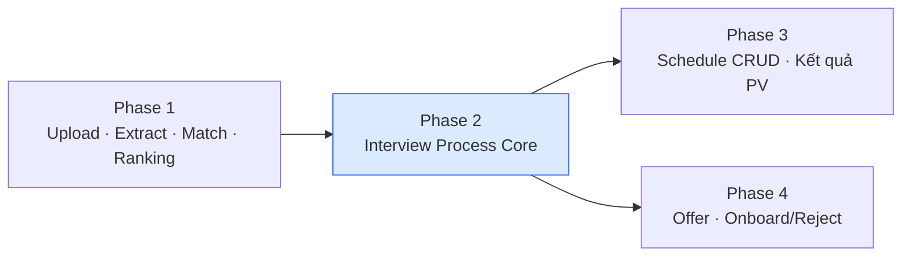

# Phase 2 — Interview Process Core

> **Mục tiêu:** Xây dựng module Interview Process — cho phép HR chọn ứng viên từ bảng matching, tạo quy trình phỏng vấn, theo dõi tiến trình qua stepper, và quản lý trạng thái liên hệ (bước 6.1).
>
> **Phạm vi:** Frontend (`recruitment-fe`) + API contract cần Backend (`recruitment-be`) triển khai song song.
>
> **Thời gian ước tính:** 3–4 tuần (1 dev FE + 1 dev BE).

---

## 1. Bối cảnh & vị trí trong quy trình tổng



Phase 2 nằm giữa **bảng xếp hạng matching** (bước 4–5) và **lịch phỏng vấn / offer** (bước 6.2–6.5). Sau Phase 2, HR có thể:

1. Shortlist ứng viên từ bảng matching
2. Tạo Interview Process gắn candidate + job + match score
3. Theo dõi pipeline status qua stepper
4. Đánh dấu "Đã liên hệ" (chỉ hiển thị trên hệ thống, không gửi email/SMS)

---

## 2. Hiện trạng (baseline)

### 2.1. Đã có — tái sử dụng

| Hạng mục | File / Route | Ghi chú |
|----------|--------------|---------|
| Bảng matching | `src/pages/hr/MatchResultsPage.tsx` — `/hr/matches` | Flat table, filter job, chưa có action |
| Chi tiết ứng viên | `src/pages/hr/CandidateDetailPage.tsx` — `/hr/candidates/:id` | Skills, CV preview, extract status |
| Types matching | `src/shared/types/api.ts` — `CVMatch` | Có `score`, `details`; **chưa có `pipelineStatus`** |
| Match API | `src/shared/lib/api-services.ts` — `matchService` | `getAll`, `getByJobId`, `getByCandidateId` |
| UI patterns | `BaseTable`, `PageHeader`, shadcn/ui, React Query | Convention sẵn có |
| Doc pipeline | `docs/api-contract.md` | Mô tả `pipelineStatus` trên `CVMatch` |

### 2.2. Chưa có — Phase 2 phải xây

| Hạng mục | Mô tả |
|----------|-------|
| Entity `InterviewProcess` | Bản ghi quy trình tuyển dụng cho cặp candidate × job |
| API CRUD process | Tạo, đọc, cập nhật status, ghi chú |
| Trang danh sách process | `/hr/interview-processes` |
| Trang chi tiết process | `/hr/interview-processes/:id` — stepper + timeline |
| Action từ bảng matching | Nút "Tạo Interview Process" / "Shortlist" |
| HR contact status | Toggle "Đã liên hệ / Chưa liên hệ" + timestamp |
| Sidebar navigation | Link mới trong `AppSidebar` |

---

## 3. Phạm vi Phase 2 (In / Out)

### 3.1. In scope

- [ ] Bổ sung `pipelineStatus` vào `CVMatch` (type + UI)
- [ ] Entity & API `InterviewProcess`
- [ ] Tạo process từ bảng matching (single + bulk shortlist tùy chọn)
- [ ] Trang danh sách process (filter: job, status, search)
- [ ] Trang chi tiết process với **stepper** các giai đoạn
- [ ] Bước **6.1 — HR liên hệ**: cập nhật status `CONTACTED`, ghi chú, thời gian liên hệ
- [ ] Timeline / activity log cơ bản trên chi tiết process
- [ ] Hiển thị process đang active trên `CandidateDetailPage`
- [ ] Cập nhật `docs/api-contract.md` với endpoint Phase 2 (chi tiết: [api-contract.md](./api-contract.md))

### 3.2. Out of scope (để Phase 3–4)

- Tạo / sửa / hủy lịch phỏng vấn (CRUD schedule)
- Lưu kết quả phỏng vấn
- Deal benefits / offer
- Onboard / Reject cuối cùng
- Gửi email / SMS / notification ngoài hệ thống
- Auth / phân quyền HR vs Admin

---

## 4. Thiết kế dữ liệu

### 4.1. Pipeline Status

Mở rộng enum đã có trong `docs/api-contract.md`:

```typescript
type PipelineStatus =
  | 'NONE'                  // Match mới, chưa vào pipeline
  | 'SHORTLISTED'           // HR đã chọn, process được tạo
  | 'CONTACTED'             // HR đã liên hệ (6.1)
  | 'INTERVIEW_SCHEDULED'   // Phase 3
  | 'INTERVIEW_DONE'        // Phase 3
  | 'OFFER'                 // Phase 4
  | 'ONBOARDED'             // Phase 4
  | 'REJECTED';             // Phase 4 — có thể reject ở bất kỳ bước nào
```

**Phase 2 chỉ implement transition:** `NONE → SHORTLISTED → CONTACTED`.

### 4.2. InterviewProcess

```typescript
interface InterviewProcess {
  id: number;
  matchId: number;
  candidateId: number;
  candidateName: string;
  jobId: number;
  jobTitle: string;
  matchScore: number;
  status: PipelineStatus;       // trạng thái hiện tại của process
  contactStatus: ContactStatus; // chi tiết bước 6.1
  contactNote?: string;
  contactedAt?: string;         // ISO8601 — set khi đánh dấu đã liên hệ
  assignedHr?: string;          // tên HR phụ trách (text, chưa cần user entity)
  notes?: string;               // ghi chú chung
  createdAt: string;
  updatedAt: string;
}

type ContactStatus = 'NOT_CONTACTED' | 'CONTACTED';

interface ProcessActivity {
  id: number;
  processId: number;
  action: string;               // e.g. "CREATED", "STATUS_CHANGED", "CONTACT_MARKED"
  fromStatus?: PipelineStatus;
  toStatus?: PipelineStatus;
  note?: string;
  performedBy?: string;
  createdAt: string;
}
```

### 4.3. Quy tắc nghiệp vụ

| Rule | Mô tả |
|------|-------|
| Unique process | Một cặp `(candidateId, jobId)` chỉ có **tối đa 1** process `ACTIVE` (status ≠ REJECTED, ONBOARDED) |
| Tạo process | Chỉ tạo khi `CVMatch` tồn tại; tự set `pipelineStatus = SHORTLISTED` trên match |
| Contact | Chỉ cho phép khi `status >= SHORTLISTED`; đánh dấu contact → `status = CONTACTED`, `contactStatus = CONTACTED` |
| Reject sớm | Phase 2 **optional**: cho phép reject từ SHORTLISTED/CONTACTED (nếu BE sẵn sàng) |
| Threshold | UI gợi ý shortlist khi `score >= job.minMatchingScore` (badge, không block) |

---

## 5. API Contract (Phase 2)

> Base path theo FE hiện tại: `/v1/...` — cần thống nhất với BE trước khi code.

### 5.1. Cập nhật CVMatch

**GET** `/matches`, `/matches/job/:jobId`, `/matches/candidate/:candidateId`

Response bổ sung field:

```json
{
  "pipelineStatus": "NONE | SHORTLISTED | CONTACTED | ..."
}
```

**PATCH** `/matches/:matchId/pipeline-status`

```json
{ "pipelineStatus": "SHORTLISTED" }
```

> Dùng khi chỉ cần shortlist mà chưa tạo full process (tùy chọn — ưu tiên tạo process trực tiếp).

### 5.2. Interview Process

| Method | Path | Body | Response | Mô tả |
|--------|------|------|----------|-------|
| `GET` | `/interview-processes` | Query: `jobId`, `status`, `search`, `page`, `size` | `InterviewProcess[]` | Danh sách |
| `GET` | `/interview-processes/:id` | — | `InterviewProcess` + `activities[]` | Chi tiết |
| `POST` | `/interview-processes` | `{ matchId, assignedHr?, notes? }` | `InterviewProcess` | Tạo từ match |
| `PATCH` | `/interview-processes/:id` | `{ assignedHr?, notes? }` | `InterviewProcess` | Cập nhật metadata |
| `POST` | `/interview-processes/:id/contact` | `{ contactStatus, contactNote? }` | `InterviewProcess` | Bước 6.1 |
| `POST` | `/interview-processes/:id/reject` | `{ reason }` | `InterviewProcess` | Reject sớm (optional) |
| `GET` | `/interview-processes/candidate/:candidateId` | — | `InterviewProcess[]` | Process theo ứng viên |

**POST** `/interview-processes` — validation:

- `matchId` bắt buộc, match phải tồn tại
- Trả `409 Conflict` nếu đã có process active cho cùng candidate + job

**POST** `/interview-processes/:id/contact`:

```json
{
  "contactStatus": "CONTACTED",
  "contactNote": "Đã gọi điện, ứng viên đồng ý phỏng vấn tuần sau"
}
```

- Set `contactedAt = now()` khi `contactStatus = CONTACTED`
- Cập nhật `status = CONTACTED` trên process và `pipelineStatus` trên match

---

## 6. Thiết kế UI/UX

### 6.1. Routes mới

| Route | Page | Mô tả |
|-------|------|-------|
| `/hr/interview-processes` | `InterviewProcessesPage` | Danh sách tất cả process |
| `/hr/interview-processes/:id` | `InterviewProcessDetailPage` | Chi tiết + stepper |

Cập nhật `App.tsx`, `AppSidebar.tsx` — thêm menu **"Interview Process"** (icon: `GitBranch` hoặc `Workflow`).

### 6.2. MatchResultsPage — nâng cấp

| Thay đổi | Chi tiết |
|----------|----------|
| Cột mới | `Pipeline Status` — badge màu |
| Cột action | Nút **"Tạo Process"** (disabled nếu đã có process / đã SHORTLISTED) |
| Sort | Mặc định sort `score DESC` (có thể làm trong Phase 1, nhưng bắt buộc trước khi shortlist) |
| Confirm dialog | Xác nhận trước khi tạo process, hiển thị candidate + job + score |

### 6.3. InterviewProcessesPage

```
┌─────────────────────────────────────────────────────────────┐
│ Interview Process                    [Filter Job ▼] [Search]│
├─────────────────────────────────────────────────────────────┤
│ # │ Candidate │ Job │ Score │ Status │ Contact │ Updated   │
│ 1 │ Nguyễn A  │ Dev │  85   │ CONTACTED │ ✓ │ 30/05/2026 │
│ 2 │ Trần B    │ QA  │  72   │ SHORTLISTED │ — │ 29/05/2026│
└─────────────────────────────────────────────────────────────┘
```

- Filter: job, pipeline status, contact status
- Click row → navigate chi tiết
- Empty state: hướng dẫn "Tạo process từ trang Matching CV"

### 6.4. InterviewProcessDetailPage — Stepper

```
  [Shortlist] ──► [Liên hệ HR] ──► [Lên lịch PV] ──► [Kết quả] ──► [Offer] ──► [Onboard]
       ✓               ✓              ○ (Phase 3)      ○            ○           ○

┌─ Thông tin ─────────────────┐  ┌─ Liên hệ (6.1) ──────────────────┐
│ Ứng viên: Nguyễn A          │  │ Status: [Chưa liên hệ ▼]         │
│ Job: Senior Developer       │  │ Ghi chú: ___________________     │
│ Match score: 85             │  │ [Lưu]                            │
│ HR phụ trách: ___________   │  └──────────────────────────────────┘
└─────────────────────────────┘

┌─ Timeline ──────────────────────────────────────────────────────────┐
│ 30/05 14:00 — Đánh dấu đã liên hệ                                   │
│ 29/05 10:30 — Tạo Interview Process từ Matching CV                  │
└─────────────────────────────────────────────────────────────────────┘
```

- Stepper: bước Phase 3+ hiển thị **disabled/locked** với tooltip "Sẽ có ở Phase 3"
- Panel liên hệ: form đơn giản, không gửi notification
- Link nhanh: sang Candidate detail, Matching CV

### 6.5. CandidateDetailPage — bổ sung section

Thêm card **"Interview Processes"** — danh sách process active của ứng viên, link sang chi tiết.

### 6.6. Components mới (dự kiến)

```
src/shared/
├── types/api.ts                          # + InterviewProcess, PipelineStatus, ProcessActivity
├── lib/api-services.ts                   # + interviewProcessService
├── components/hr/
│   ├── PipelineStatusBadge.tsx
│   ├── ContactStatusBadge.tsx
│   ├── ProcessStepper.tsx
│   ├── CreateProcessDialog.tsx
│   └── ContactStatusForm.tsx
src/pages/hr/
├── InterviewProcessesPage.tsx
└── InterviewProcessDetailPage.tsx
```

---

## 7. Kế hoạch thực hiện chi tiết

### Tuần 1 — Foundation & API (BE + FE song song)

#### Sprint 1.1 — Backend (3–4 ngày)

| # | Task | Owner | Deliverable |
|---|------|-------|-------------|
| 1.1.1 | Thiết kế DB: bảng `interview_processes`, `process_activities` | BE | Migration script |
| 1.1.2 | Thêm cột `pipeline_status` vào bảng matches (nếu chưa có) | BE | Migration |
| 1.1.3 | Implement `POST /interview-processes` | BE | API + validation unique |
| 1.1.4 | Implement `GET /interview-processes` (filter, pagination) | BE | API |
| 1.1.5 | Implement `GET /interview-processes/:id` (+ activities) | BE | API |
| 1.1.6 | Implement `POST /interview-processes/:id/contact` | BE | API + auto timestamp |
| 1.1.7 | Cập nhật GET `/matches*` trả `pipelineStatus` | BE | API |
| 1.1.8 | Unit test + Postman collection | BE | Test coverage |

#### Sprint 1.2 — Frontend foundation (3–4 ngày)

| # | Task | Owner | Deliverable |
|---|------|-------|-------------|
| 1.2.1 | Cập nhật `api.ts`: `PipelineStatus`, `InterviewProcess`, `ProcessActivity` | FE | Types |
| 1.2.2 | Thêm `pipelineStatus` vào `CVMatch` | FE | Types |
| 1.2.3 | Tạo `interviewProcessService` trong `api-services.ts` | FE | Service layer |
| 1.2.4 | Tạo `PipelineStatusBadge`, `ContactStatusBadge` | FE | Components |
| 1.2.5 | Thêm routes + sidebar link (page placeholder) | FE | Routing |
| 1.2.6 | Hoàn thiện `docs/phase2/api-contract.md` + `ui-spec.md` | FE | Doc |

**Milestone Tuần 1:** API contact được gọi thành công từ Postman; FE types + service sẵn sàng.

---

### Tuần 2 — Danh sách Process & Tích hợp Matching

#### Sprint 2.1 — InterviewProcessesPage (3 ngày)

| # | Task | Owner | Deliverable |
|---|------|-------|-------------|
| 2.1.1 | Build `InterviewProcessesPage` với `BaseTable` | FE | Page |
| 2.1.2 | Filter: job, status, search (debounce) | FE | UX |
| 2.1.3 | Empty state + loading skeleton | FE | UX |
| 2.1.4 | Row click → navigate detail | FE | Navigation |

#### Sprint 2.2 — MatchResultsPage integration (2 ngày)

| # | Task | Owner | Deliverable |
|---|------|-------|-------------|
| 2.2.1 | Thêm cột `pipelineStatus` + badge | FE | Table column |
| 2.2.2 | Nút "Tạo Process" + `CreateProcessDialog` | FE | Action |
| 2.2.3 | Mutation `POST /interview-processes` + invalidate queries | FE | React Query |
| 2.2.4 | Disable nút khi đã có process (check status) | FE | Validation UX |
| 2.2.5 | Toast success/error | FE | Feedback |

**Milestone Tuần 2:** HR tạo process từ bảng matching → thấy trong danh sách process.

---

### Tuần 3 — Chi tiết Process & HR Contact (6.1)

#### Sprint 3.1 — ProcessStepper & Detail layout (3 ngày)

| # | Task | Owner | Deliverable |
|---|------|-------|-------------|
| 3.1.1 | Build `ProcessStepper` — 7 bước, lock Phase 3+ | FE | Component |
| 3.1.2 | Build `InterviewProcessDetailPage` layout | FE | Page |
| 3.1.3 | Panel thông tin: candidate, job, score, assigned HR | FE | Info section |
| 3.1.4 | Link nhanh candidate / job | FE | Navigation |

#### Sprint 3.2 — Contact status form (2 ngày)

| # | Task | Owner | Deliverable |
|---|------|-------|-------------|
| 3.2.1 | Build `ContactStatusForm` | FE | Form |
| 3.2.2 | Mutation `POST .../contact` | FE | API integration |
| 3.2.3 | Hiển thị `contactedAt`, `contactNote` sau lưu | FE | Read state |
| 3.2.4 | Stepper cập nhật realtime sau contact | FE | UX |

#### Sprint 3.3 — Timeline & CandidateDetail (2 ngày)

| # | Task | Owner | Deliverable |
|---|------|-------|-------------|
| 3.3.1 | Timeline component từ `activities[]` | FE | Component |
| 3.3.2 | Section "Interview Processes" trên `CandidateDetailPage` | FE | Integration |
| 3.3.3 | BE: ghi activity log khi create / contact | BE | Audit trail |

**Milestone Tuần 3:** HR mở chi tiết process → đánh dấu đã liên hệ → stepper + timeline cập nhật.

---

### Tuần 4 — Hoàn thiện, test & doc

#### Sprint 4.1 — Polish & edge cases (2 ngày)

| # | Task | Owner | Deliverable |
|---|------|-------|-------------|
| 4.1.1 | Xử lý 409 duplicate process — hiển thị message rõ | FE | Error UX |
| 4.1.2 | Confirm dialog reject (nếu implement) | FE | Optional |
| 4.1.3 | Responsive layout detail page | FE | Mobile/tablet |
| 4.1.4 | i18n labels tiếng Việt thống nhất | FE | Copy |

#### Sprint 4.2 — Testing (2 ngày)

| # | Task | Owner | Deliverable |
|---|------|-------|-------------|
| 4.2.1 | E2E: Tạo process từ matching → contact → verify status | FE | Playwright test |
| 4.2.2 | Unit test service + badge components | FE | Vitest |
| 4.2.3 | BE integration test full flow | BE | Test suite |
| 4.2.4 | Manual QA checklist (xem §8) | QA | Sign-off |

#### Sprint 4.3 — Documentation & handoff (1 ngày)

| # | Task | Owner | Deliverable |
|---|------|-------|-------------|
| 4.3.1 | Finalize `docs/api-contract.md` | FE + BE | Doc |
| 4.3.2 | Ghi chú dependency Phase 3 (schedule endpoints) | FE | Doc |
| 4.3.3 | Demo walkthrough cho stakeholder | All | Demo |

**Milestone Tuần 4:** Phase 2 merge-ready, QA pass, sẵn sàng Phase 3.

---

## 8. Acceptance Criteria (Definition of Done)

### 8.1. Functional

- [ ] HR xem bảng matching có cột pipeline status và sort theo score
- [ ] HR tạo Interview Process từ 1 dòng matching; hệ thống chặn tạo trùng
- [ ] Process mới có status `SHORTLISTED`, match có `pipelineStatus = SHORTLISTED`
- [ ] HR xem danh sách tất cả process, filter theo job và status
- [ ] HR mở chi tiết process, thấy stepper với bước Shortlist ✓, Liên hệ active
- [ ] HR đánh dấu "Đã liên hệ" + ghi chú → status `CONTACTED`, lưu `contactedAt`
- [ ] Timeline hiển thị lịch sử create + contact
- [ ] Trang chi tiết ứng viên hiển thị process đang active
- [ ] Các bước Phase 3+ hiển thị locked, không crash

### 8.2. Non-functional

- [ ] API response < 500ms (danh sách < 100 records)
- [ ] Không breaking change với API Phase 1 hiện có
- [ ] Error toast thống nhất với pattern `App.tsx` QueryCache
- [ ] TypeScript strict — không `any` mới trong code Phase 2

---

## 9. Rủi ro & phụ thuộc

| Rủi ro | Mức | Giảm thiểu |
|--------|-----|------------|
| BE chưa có endpoint `/interview-processes` | Cao | Mock API hoặc MSW trong tuần 1 FE; contract-first |
| Mâu thuẫn `api-contract.md` vs `api_contracts.md` | Cao | Chốt 1 doc chính thức trước Sprint 1.1 |
| `pipelineStatus` trên match vs status trên process | Trung bình | BE sync 2 field; FE đọc từ process là source of truth |
| Phase 1 chưa sort ranking | Thấp | FE sort client-side tạm nếu BE chưa hỗ trợ |

**Phụ thuộc bắt buộc trước Phase 2:**

1. Phase 1 hoàn thành **sort ranking** và **pipelineStatus trên GET /matches** (hoặc BE commit làm song song tuần 1)
2. BE đồng ý API contract §5 của tài liệu này

---

## 10. Handoff sang Phase 3

Sau Phase 2, các điểm mở rộng trực tiếp:

| Từ Phase 2 | Phase 3 sẽ làm |
|------------|----------------|
| Stepper bước "Lên lịch PV" (locked) | Unlock + `POST /schedules/interviews` |
| `status = CONTACTED` | Transition → `INTERVIEW_SCHEDULED` khi tạo lịch |
| `InterviewProcess.id` | FK từ `InterviewSchedule.processId` |
| Timeline | Thêm event "Interview scheduled" |

---

## 11. Checklist tổng hợp theo file FE

| File | Hành động |
|------|-----------|
| `src/shared/types/api.ts` | Thêm types Phase 2 |
| `src/shared/lib/api-services.ts` | Thêm `interviewProcessService` |
| `src/shared/components/hr/PipelineStatusBadge.tsx` | **Tạo mới** |
| `src/shared/components/hr/ContactStatusBadge.tsx` | **Tạo mới** |
| `src/shared/components/hr/ProcessStepper.tsx` | **Tạo mới** |
| `src/shared/components/hr/CreateProcessDialog.tsx` | **Tạo mới** |
| `src/shared/components/hr/ContactStatusForm.tsx` | **Tạo mới** |
| `src/pages/hr/InterviewProcessesPage.tsx` | **Tạo mới** |
| `src/pages/hr/InterviewProcessDetailPage.tsx` | **Tạo mới** |
| `src/pages/hr/MatchResultsPage.tsx` | Thêm cột status + action |
| `src/pages/hr/CandidateDetailPage.tsx` | Thêm section processes |
| `src/App.tsx` | Thêm 2 routes |
| `src/shared/components/AppSidebar.tsx` | Thêm nav link |
| `docs/api-contract.md` | Bổ sung § Interview Process |

---

*Tài liệu này là plan triển khai Phase 2. Cập nhật khi API contract hoặc scope thay đổi.*
