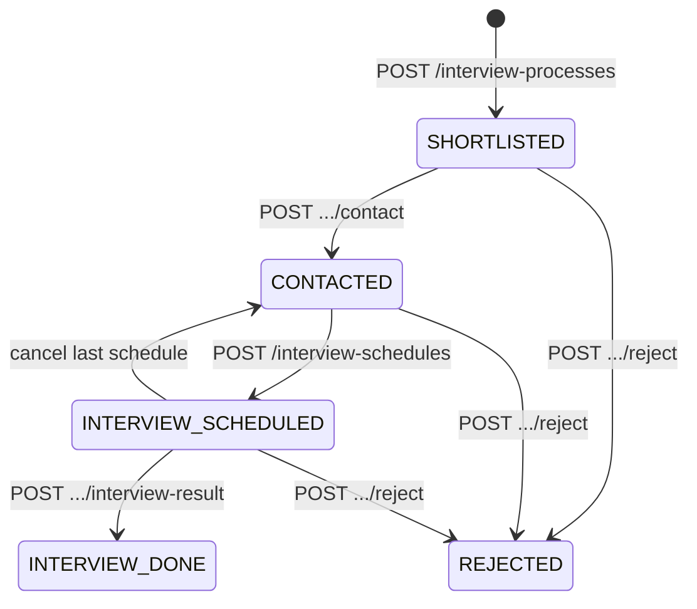

# Phase 3 — API Contract: Interview Schedules & Results

> **Base URL:** `http://localhost:8081/v1`  
> **Response wrapper:** `CodeResponse<T>` (giống Phase 1–2)  
> **Timezone mặc định:** `Asia/Ho_Chi_Minh` (+07) — mọi `startDate`/`endDate` kiểu **date** được hiểu theo timezone này trừ khi gửi `timezone` query.

---

## 1. Tổng quan endpoint

| Method | Path | Mô tả |
|--------|------|-------|
| `GET` | `/interview-schedules` | **Calendar** — lịch trong khoảng ngày |
| `GET` | `/interview-schedules/:id` | Chi tiết một lịch |
| `POST` | `/interview-schedules` | Tạo lịch PV |
| `PATCH` | `/interview-schedules/:id` | Sửa lịch (reschedule) |
| `POST` | `/interview-schedules/:id/cancel` | Hủy lịch |
| `GET` | `/interview-processes/:id/schedules` | Danh sách lịch của process |
| `POST` | `/interview-processes/:id/interview-result` | Ghi kết quả PV |

Phase 2 giữ nguyên: [phase2/api-contract.md](../phase2/api-contract.md) §4.2.

---

## 2. Calendar — `GET /interview-schedules`

Dùng cho màn **lịch phỏng vấn** (`/hr/calendar`). FE chọn chế độ **ngày / tuần / tháng** → tính `startDate` và `endDate` → gọi API (xem §2.3).

### 2.1. Query parameters

| Param | Type | Required | Mô tả |
|-------|------|----------|-------|
| `startDate` | `string` (date) | ✓ | Ngày bắt đầu khoảng xem, `YYYY-MM-DD` |
| `endDate` | `string` (date) | ✓ | Ngày kết thúc khoảng xem, `YYYY-MM-DD` |
| `timezone` | `string` | | IANA, default `Asia/Ho_Chi_Minh` |
| `jobId` | `number` | | Lọc theo job |
| `candidateId` | `number` | | Lọc theo ứng viên |
| `assignedHr` | `string` | | Lọc HR phụ trách buổi PV |
| `format` | `InterviewFormat` | | `ONLINE` \| `ONSITE` \| `PHONE` |
| `includeCancelled` | `boolean` | | Default `false` |

**Query tắt (tuỳ chọn — BE có thể hỗ trợ sau):**

| Param | Type | Mô tả |
|-------|------|-------|
| `view` | `day` \| `week` \| `month` | BE tự tính range từ `anchorDate` |
| `anchorDate` | `YYYY-MM-DD` | Ngày neo (mặc định hôm nay) |

> **Khuyến nghị:** FE **luôn** gửi `startDate` + `endDate` đã tính sẵn (dễ test, không phụ thuộc locale server). `view` + `anchorDate` chỉ là shortcut nếu BE implement.

### 2.2. Semantics — overlap

Trả về mọi schedule có trạng thái `SCHEDULED` hoặc `COMPLETED` (và `CANCELLED` nếu `includeCancelled=true`) mà **giao** với khoảng:

```text
[ startDate 00:00:00.000 , endDate 23:59:59.999 ]  (theo timezone)
```

Điều kiện SQL (gợi ý):

```sql
scheduled_start < :rangeEnd
AND scheduled_end > :rangeStart
AND status IN ('SCHEDULED', 'COMPLETED' [, 'CANCELLED'])
```

Sắp xếp mặc định: `scheduled_start ASC`.

### 2.3. FE — map chế độ UI → `startDate` / `endDate`

FE dùng **một API** cho cả 3 chế độ; chỉ khác cách tính range (ví dụ `date-fns`, locale `vi`, **tuần bắt đầu Thứ Hai**).

| `calendarView` | Ý nghĩa | `startDate` | `endDate` |
|----------------|---------|-------------|-----------|
| `day` | Một ngày | `format(anchor, 'yyyy-MM-dd')` | **cùng ngày** |
| `week` | Tuần chứa `anchor` | `format(startOfWeek(anchor, { weekStartsOn: 1 }), ...)` | `format(endOfWeek(anchor, { weekStartsOn: 1 }), ...)` |
| `month` | Tháng chứa `anchor` | `format(startOfMonth(anchor), ...)` | `format(endOfMonth(anchor), ...)` |

**Ví dụ:** `anchorDate = 2026-05-30` (Thứ Sáu)

| View | startDate | endDate |
|------|-----------|---------|
| day | `2026-05-30` | `2026-05-30` |
| week | `2026-05-26` (T2) | `2026-06-01` (CN) |
| month | `2026-05-01` | `2026-05-31` |

**Khi user đổi view hoặc next/prev:**

```typescript
// Pseudocode
function fetchCalendar(view: 'day' | 'week' | 'month', anchor: Date, filters: Filters) {
  const { startDate, endDate } = resolveRange(view, anchor); // §2.3 table
  return api.get('/v1/interview-schedules', {
    params: { startDate, endDate, timezone: 'Asia/Ho_Chi_Minh', ...filters },
  });
}
```

**Invalidate React Query:** key `['interview-schedules', startDate, endDate, filters]`.

### 2.4. Response — `InterviewScheduleCalendarResponse`

```json
{
  "success": true,
  "message": "SUCCESS",
  "data": {
    "startDate": "2026-05-26",
    "endDate": "2026-06-01",
    "timezone": "Asia/Ho_Chi_Minh",
    "items": [
      {
        "id": 501,
        "processId": 102,
        "candidateId": 8,
        "candidateName": "Bùi Thanh Sơn",
        "jobId": 1,
        "jobTitle": "Senior Frontend Developer",
        "matchScore": 85,
        "scheduledStart": "2026-05-28T14:00:00+07:00",
        "scheduledEnd": "2026-05-28T15:00:00+07:00",
        "timezone": "Asia/Ho_Chi_Minh",
        "format": "ONLINE",
        "location": null,
        "meetingUrl": "https://meet.example.com/abc",
        "status": "SCHEDULED",
        "assignedHr": "Trần Thị Lan",
        "processStatus": "INTERVIEW_SCHEDULED"
      }
    ],
    "total": 1
  }
}
```

| Field | Type | Mô tả |
|-------|------|-------|
| `startDate` / `endDate` | string | Echo query (đã resolve nếu dùng `view`) |
| `timezone` | string | Timezone áp dụng |
| `items` | array | Sự kiện trong khoảng |
| `total` | number | `items.length` (không pagination — range đã giới hạn) |

### 2.5. Errors

| HTTP | errorCode | Khi nào |
|------|-----------|---------|
| 400 | `INVALID_DATE_RANGE` | `endDate` < `startDate` hoặc range > 93 ngày |
| 400 | `MISSING_DATE_PARAMS` | Thiếu `startDate`/`endDate` (và không có `view`+`anchorDate`) |

---

## 3. Types

### 3.1. Enums

```typescript
type InterviewFormat = 'ONLINE' | 'ONSITE' | 'PHONE';

type InterviewScheduleStatus = 'SCHEDULED' | 'CANCELLED' | 'COMPLETED';

type InterviewOutcome = 'PASSED' | 'FAILED' | 'NO_SHOW' | 'WITHDRAWN';
```

### 3.2. `InterviewSchedule`

```typescript
interface InterviewSchedule {
  id: number;
  processId: number;
  candidateId: number;
  candidateName: string;
  jobId: number;
  jobTitle: string;
  scheduledStart: string;   // ISO8601 offset
  scheduledEnd: string;
  timezone: string;
  format: InterviewFormat;
  location?: string | null;
  meetingUrl?: string | null;
  status: InterviewScheduleStatus;
  notes?: string | null;
  assignedHr?: string | null;
  createdAt: string;
  updatedAt: string;
}
```

### 3.3. `InterviewResult`

```typescript
interface InterviewResult {
  id: number;
  scheduleId: number;
  processId: number;
  outcome: InterviewOutcome;
  feedback?: string | null;
  recordedBy?: string | null;
  recordedAt: string;
}
```

---

## 4. Tạo lịch — `POST /interview-schedules`

### 4.1. Request

```json
{
  "processId": 102,
  "scheduledStart": "2026-05-28T14:00:00+07:00",
  "scheduledEnd": "2026-05-28T15:00:00+07:00",
  "timezone": "Asia/Ho_Chi_Minh",
  "format": "ONLINE",
  "meetingUrl": "https://meet.example.com/abc",
  "location": null,
  "notes": "PV vòng 1 — technical",
  "assignedHr": "Trần Thị Lan"
}
```

| Field | Required | Validation |
|-------|----------|------------|
| `processId` | ✓ | Process tồn tại, không `REJECTED`/`ONBOARDED` |
| `scheduledStart` | ✓ | ISO8601; phải **trong tương lai** (≥ now − 5 phút grace) |
| `scheduledEnd` | ✓ | `> scheduledStart` |
| `format` | ✓ | Enum |
| `meetingUrl` | | Optional; có thể bổ sung sau qua PATCH |
| `location` | | Khuyến nghị bắt buộc nếu `ONSITE` |
| `timezone` | | Default `Asia/Ho_Chi_Minh` |

### 4.2. Side effects (BE)

1. Insert `interview_schedules` (`status = SCHEDULED`)
2. `interview_processes.status` → `INTERVIEW_SCHEDULED`
3. `cv_matches.pipeline_status` → `INTERVIEW_SCHEDULED`
4. Activity `INTERVIEW_SCHEDULED`

### 4.3. Response

`201 Created` — `CodeResponse<InterviewSchedule>`

### 4.4. Errors

| HTTP | errorCode | Khi nào |
|------|-----------|---------|
| 400 | `INVALID_PROCESS_STATUS` | Process chưa `CONTACTED` (hoặc `SHORTLISTED` nếu PO cho phép — **mặc định: chỉ `CONTACTED`**) |
| 409 | `SCHEDULE_ALREADY_EXISTS` | Đã có lịch `SCHEDULED` cho process (MVP) |
| 404 | `PROCESS_NOT_FOUND` | |
| 400 | `INVALID_SCHEDULE_TIME` | End ≤ start / quá khứ |

---

## 5. Sửa lịch — `PATCH /interview-schedules/:id`

Chỉ schedule `status = SCHEDULED`.

**Request** (partial):

```json
{
  "scheduledStart": "2026-05-29T10:00:00+07:00",
  "scheduledEnd": "2026-05-29T11:00:00+07:00",
  "format": "ONSITE",
  "location": "Tầng 5 — Phòng A",
  "meetingUrl": null,
  "notes": "Đổi sang onsite",
  "assignedHr": "Lê Minh Tuấn"
}
```

**Side effects:** Activity `INTERVIEW_RESCHEDULED` (không đổi process status nếu vẫn `INTERVIEW_SCHEDULED`).

**Response:** `CodeResponse<InterviewSchedule>`

| HTTP | errorCode | Khi nào |
|------|-----------|---------|
| 400 | `SCHEDULE_NOT_EDITABLE` | Đã `CANCELLED` / `COMPLETED` |
| 404 | `SCHEDULE_NOT_FOUND` | |

---

## 6. Hủy lịch — `POST /interview-schedules/:id/cancel`

**Request:**

```json
{
  "reason": "Ứng viên xin dời — chưa hẹn lại"
}
```

| Field | Required |
|-------|----------|
| `reason` | ✓ (max 2000) |

**Side effects:**

1. `schedule.status` → `CANCELLED`
2. Nếu **không** còn schedule `SCHEDULED` cho process:
   - `process.status` → `CONTACTED`
   - `match.pipeline_status` → `CONTACTED`
3. Activity `INTERVIEW_CANCELLED`

**Response:** `CodeResponse<InterviewSchedule>`

---

## 7. Lịch theo process — `GET /interview-processes/:id/schedules`

Không pagination. Trả mọi lịch (mọi status), sắp `scheduled_start DESC`.

**Response:** `CodeResponse<InterviewSchedule[]>`

**Errors:** `404 PROCESS_NOT_FOUND`

---

## 8. Ghi kết quả PV — `POST /interview-processes/:id/interview-result`

Unlock stepper **"Kết quả PV"** → `INTERVIEW_DONE`.

### 8.1. Request

```json
{
  "scheduleId": 501,
  "outcome": "PASSED",
  "feedback": "Kỹ năng React tốt, giao tiếp ổn. Đề xuất vòng offer.",
  "recordedBy": "Trần Thị Lan"
}
```

| Field | Required | Validation |
|-------|----------|------------|
| `scheduleId` | ✓ | Thuộc `processId`; schedule `SCHEDULED` hoặc đã qua giờ (`scheduled_end` < now) |
| `outcome` | ✓ | Enum |
| `feedback` | | Max 5000; khuyến nghị bắt buộc |
| `recordedBy` | | Max 100 |

### 8.2. Side effects

1. Insert `interview_results`
2. `schedule.status` → `COMPLETED`
3. `process.status` → `INTERVIEW_DONE`
4. `match.pipeline_status` → `INTERVIEW_DONE`
5. Activity `INTERVIEW_RESULT_RECORDED`

### 8.3. Response

`CodeResponse<InterviewResultDetail>` — gồm `result` + `process` (status mới).

```json
{
  "success": true,
  "data": {
    "result": {
      "id": 301,
      "scheduleId": 501,
      "processId": 102,
      "outcome": "PASSED",
      "feedback": "...",
      "recordedAt": "2026-05-28T16:30:00+07:00"
    },
    "process": {
      "id": 102,
      "status": "INTERVIEW_DONE",
      "contactStatus": "CONTACTED"
    }
  }
}
```

### 8.4. Errors

| HTTP | errorCode | Khi nào |
|------|-----------|---------|
| 400 | `INVALID_PROCESS_STATUS` | Process không ở `INTERVIEW_SCHEDULED` |
| 400 | `RESULT_ALREADY_RECORDED` | Schedule đã có result |
| 404 | `SCHEDULE_NOT_FOUND` | |
| 404 | `PROCESS_NOT_FOUND` | |

---

## 9. Chi tiết lịch — `GET /interview-schedules/:id`

**Response:** `CodeResponse<InterviewScheduleDetail>` — schedule + `process` summary + `result?` nếu có.

---

## 10. State machine (process)



| Transition | API |
|------------|-----|
| → `INTERVIEW_SCHEDULED` | `POST /interview-schedules` |
| → `CONTACTED` (revert) | `POST /interview-schedules/:id/cancel` (no active schedule) |
| → `INTERVIEW_DONE` | `POST /interview-processes/:id/interview-result` |

---

## 11. React Query keys (FE)

| Key | Endpoint |
|-----|----------|
| `['interview-schedules', startDate, endDate, filters]` | GET calendar |
| `['interview-schedule', id]` | GET by id |
| `['interview-process', id, 'schedules']` | GET by process |
| `['interview-process', id]` | Detail (invalidate sau result) |

**Invalidate sau mutation:**

| Mutation | Invalidate |
|----------|------------|
| POST /interview-schedules | calendar keys, `interview-process`, `interview-processes`, `matches` |
| PATCH / cancel schedule |同上 |
| POST .../interview-result | `interview-process`, calendar, `matches` |

---

## 12. cURL examples

### Calendar — tuần

```bash
curl "http://localhost:8081/v1/interview-schedules?startDate=2026-05-26&endDate=2026-06-01&timezone=Asia/Ho_Chi_Minh"
```

### Calendar — shortcut (nếu BE hỗ trợ)

```bash
curl "http://localhost:8081/v1/interview-schedules?view=month&anchorDate=2026-05-30"
```

### Tạo lịch

```bash
curl -X POST http://localhost:8081/v1/interview-schedules \
  -H "Content-Type: application/json" \
  -d '{
    "processId": 102,
    "scheduledStart": "2026-05-28T14:00:00+07:00",
    "scheduledEnd": "2026-05-28T15:00:00+07:00",
    "format": "ONLINE",
    "meetingUrl": "https://meet.example.com/abc"
  }'
```

### Ghi kết quả

```bash
curl -X POST http://localhost:8081/v1/interview-processes/102/interview-result \
  -H "Content-Type: application/json" \
  -d '{
    "scheduleId": 501,
    "outcome": "PASSED",
    "feedback": "Đạt vòng 1"
  }'
```

---

## 13. So với Phase 2

| Phase 2 | Phase 3 |
|---------|---------|
| Stepper bước 3–4 **locked** | Unlock sau implement |
| Không bảng schedule | `interview_schedules`, `interview_results` |
| `INTERVIEW_SCHEDULED` chỉ trên enum | Set qua API thật |

Implement BE: xem [plan.md](./plan.md) migration `V1_7_0`.
