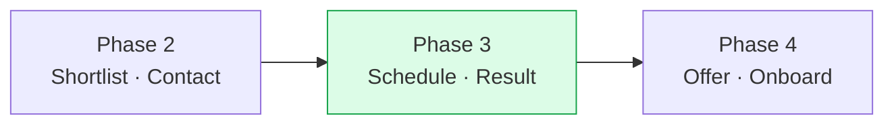
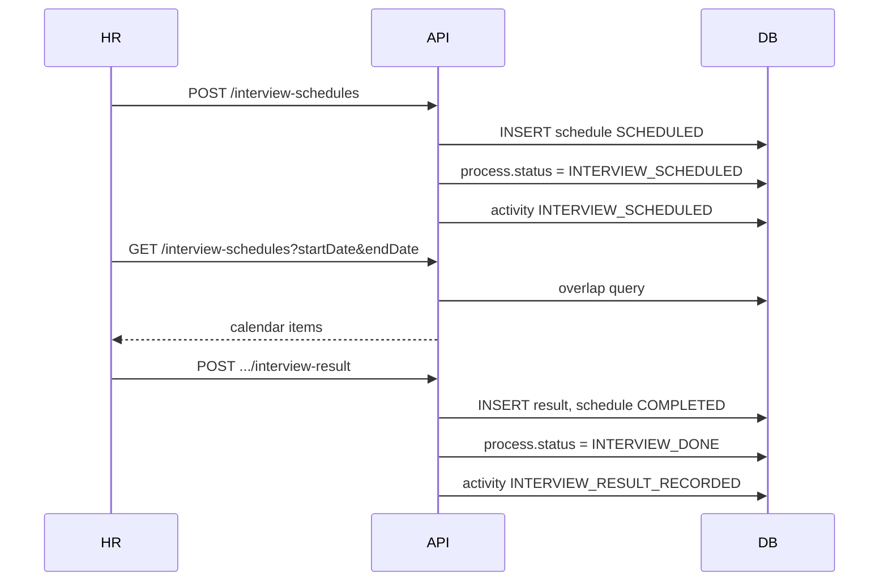

# Phase 3 — Interview Schedule & Results

> **Mục tiêu:** Hoàn thiện pipeline sau bước HR liên hệ — lên lịch phỏng vấn, xem lịch theo calendar, ghi kết quả PV.  
> **Phụ thuộc:** Phase 2 đã deploy (`interview_processes`, `process_activities`, API `/v1/interview-processes`).

---

## 1. Vị trí trong quy trình



| Giai đoạn | Status process | Phase |
|-----------|----------------|-------|
| Tạo process | `SHORTLISTED` | 2 ✓ |
| HR liên hệ | `CONTACTED` | 2 ✓ |
| Lên lịch PV | `INTERVIEW_SCHEDULED` | **3** |
| Có kết quả PV | `INTERVIEW_DONE` | **3** |
| Offer / Onboard | `OFFER` / `ONBOARDED` | 4 |

---

## 2. Phase 2 đã có vs Phase 3 cần làm

### 2.1. Đã có (BE)

| API | Mô tả |
|-----|-------|
| `POST /v1/interview-processes` | Tạo process |
| `POST .../contact` | `CONTACTED` |
| `POST .../reject` | `REJECTED` |
| `PATCH .../{id}` | Metadata |
| `GET` list / detail / by candidate | Đọc process |

### 2.2. Chưa có — Phase 3

| Hạng mục | Mô tả |
|----------|-------|
| Bảng `interview_schedules` | Lịch PV gắn `process_id` |
| Bảng `interview_results` *(hoặc cột trên schedule)* | Kết quả PV |
| `POST /v1/interview-schedules` | Tạo lịch |
| `GET /v1/interview-schedules` | Calendar theo `startDate`–`endDate` |
| `PATCH /v1/interview-schedules/:id` | Đổi giờ / địa điểm / link |
| `POST /v1/interview-schedules/:id/cancel` | Hủy lịch |
| `GET /v1/interview-processes/:id/schedules` | Lịch theo process (detail page) |
| `POST /v1/interview-processes/:id/interview-result` | Ghi kết quả → `INTERVIEW_DONE` |
| Activity log | `INTERVIEW_SCHEDULED`, `INTERVIEW_RESCHEDULED`, `INTERVIEW_CANCELLED`, `INTERVIEW_RESULT_RECORDED` |
| Cập nhật `cv_matches.pipeline_status` | Đồng bộ với process |

### 2.3. Out of scope Phase 3

- `OFFER`, `ONBOARDED` (Phase 4)
- Email / SMS / Google Calendar sync
- Phân quyền HR vs Admin
- Nhiều vòng PV song song phức tạp *(MVP: 1 lịch `SCHEDULED` active / process; vòng mới sau khi ghi kết quả hoặc hủy)*

---

## 3. Thiết kế dữ liệu (Flyway)

**Migration gợi ý:** `V1_7_0__interview_schedules_and_results.sql`

### 3.1. `interview_schedules`

| Cột | Type | Mô tả |
|-----|------|-------|
| `id` | BIGSERIAL PK | |
| `process_id` | BIGINT FK → `interview_processes` | Bắt buộc |
| `candidate_id` | BIGINT FK | Denormalize — query calendar |
| `job_id` | BIGINT FK | Denormalize |
| `scheduled_start` | TIMESTAMPTZ | Bắt đầu PV |
| `scheduled_end` | TIMESTAMPTZ | Kết thúc PV |
| `timezone` | VARCHAR(50) | Default `Asia/Ho_Chi_Minh` |
| `format` | VARCHAR(20) | `ONLINE` \| `ONSITE` \| `PHONE` |
| `location` | VARCHAR(255) | Địa điểm / phòng |
| `meeting_url` | VARCHAR(500) | Link online |
| `status` | VARCHAR(20) | `SCHEDULED` \| `CANCELLED` \| `COMPLETED` |
| `notes` | TEXT | Ghi chú HR |
| `assigned_hr` | VARCHAR(100) | Người phụ trách buổi PV |
| `created_at`, `updated_at` | TIMESTAMPTZ | |

**Index:**

- `idx_interview_schedules_start` ON `(scheduled_start)` — calendar range
- `idx_interview_schedules_process_id`
- `idx_interview_schedules_job_id`, `candidate_id` — filter

**Ràng buộc MVP:**

```sql
CREATE UNIQUE INDEX uk_interview_schedules_one_active_per_process
  ON interview_schedules (process_id)
  WHERE status = 'SCHEDULED';
```

### 3.2. `interview_results`

| Cột | Type | Mô tả |
|-----|------|-------|
| `id` | BIGSERIAL PK | |
| `schedule_id` | BIGINT FK UNIQUE | 1 kết quả / 1 lịch |
| `process_id` | BIGINT FK | |
| `outcome` | VARCHAR(30) | `PASSED` \| `FAILED` \| `NO_SHOW` \| `WITHDRAWN` |
| `feedback` | TEXT | Nhận xét PV |
| `recorded_by` | VARCHAR(100) | |
| `recorded_at` | TIMESTAMPTZ | |

### 3.3. `process_activities.action`

Mở rộng CHECK hoặc bỏ CHECK cứng — thêm:

- `INTERVIEW_SCHEDULED`
- `INTERVIEW_RESCHEDULED`
- `INTERVIEW_CANCELLED`
- `INTERVIEW_RESULT_RECORDED`

---

## 4. Luồng nghiệp vụ



**Hủy lịch:** nếu không còn schedule `SCHEDULED` → process về `CONTACTED`, match `pipeline_status` đồng bộ.

---

## 5. Lộ trình gợi ý (2 tuần)

| Tuần | BE | FE |
|------|----|----|
| 1 | Migration + entity + `InterviewScheduleController` + calendar GET | Types + `interviewScheduleService` |
| 1 | Create / PATCH / cancel + transition process | Form lên lịch trên process detail |
| 2 | Interview result endpoint + activities | Calendar page day/week/month |
| 2 | Tests integration + cập nhật `database.md` | Stepper unlock bước 3–4 |

---

## 6. Handoff Phase 4

| Từ Phase 3 | Phase 4 |
|------------|---------|
| `INTERVIEW_DONE` + outcome `PASSED` | `POST .../offer` → `OFFER` |
| Onboard confirm | `ONBOARDED` |

Chi tiết API: [api-contract.md](./api-contract.md).
