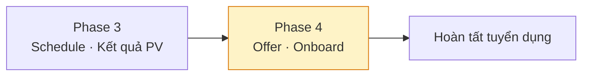
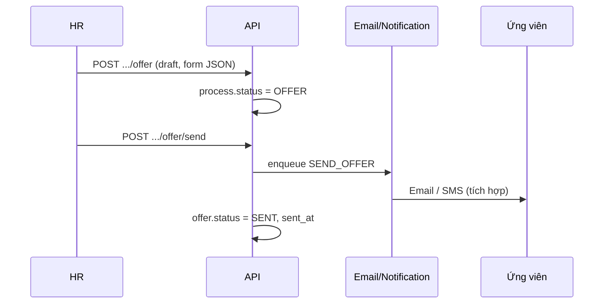
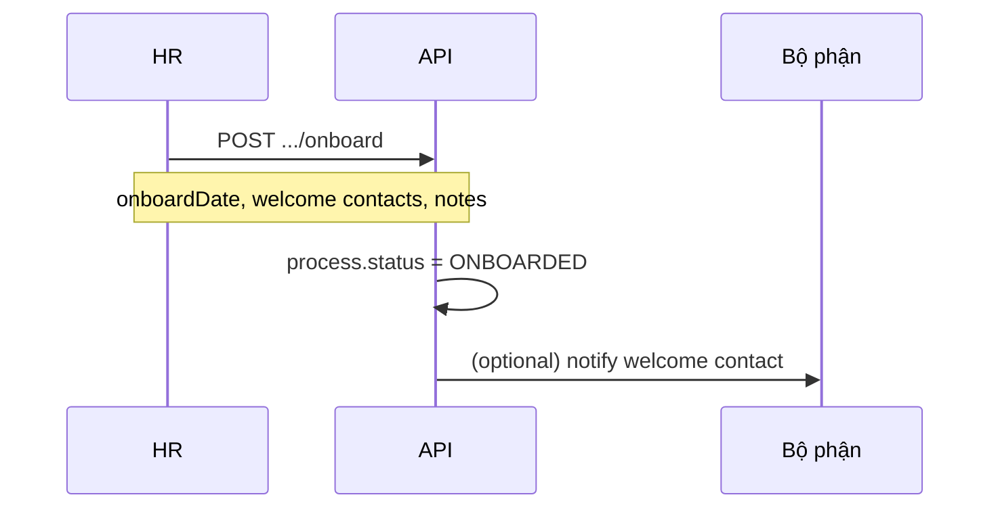
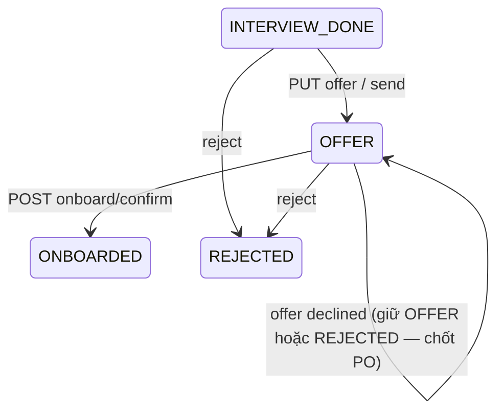

# Phase 4 — Offer & Onboard (Kế hoạch)

> **Mục tiêu:** Sau khi ứng viên **đã phỏng vấn** (`INTERVIEW_DONE`), HR soạn **offer** (form trừu tượng / có thể mở rộng), hệ thống **gửi tự động** cho ứng viên; khi chấp nhận / sẵn sàng vào làm, HR ghi **ngày onboard** và **phân công đón tiếp** theo bộ phận.
>
> **Phụ thuộc:** Phase 3 (`interview_results`, `INTERVIEW_DONE`).

---

## 1. Vị trí trong quy trình tổng



| # | Bước nghiệp vụ (HR) | `interview_processes.status` | Ghi chú |
|---|---------------------|------------------------------|---------|
| 1 | Shortlist / Process | `SHORTLISTED` | Phase 2 |
| 2 | Liên hệ ứng viên | `CONTACTED` | Phase 2 |
| 3 | Lên lịch PV | `INTERVIEW_SCHEDULED` | Phase 3 |
| 4 | Ghi kết quả PV | `INTERVIEW_DONE` | Phase 3 — **cổng vào Phase 4** |
| 5 | Soạn & gửi Offer | `OFFER` | **Phase 4** |
| 6 | Xác nhận Onboard | `ONBOARDED` | **Phase 4** — terminal (thành công) |
| * | Từ chối | `REJECTED` | Mọi giai đoạn |

**Trạng thái hiện tại trên UI (sau PV):** *Đã phỏng vấn* = `INTERVIEW_DONE`. Calendar **không** hiển thị lịch `COMPLETED` (chỉ `SCHEDULED` — đã cập nhật GET calendar).

---

## 2. Phạm vi Phase 4

### 2.1. In scope

#### Offer

- [ ] Form offer **trừu tượng** (schema linh hoạt — JSON / key-value), MVP gợi ý:
  - Mức lương / khoảng lương (`salary`, `currency`)
  - Chế độ phúc lợi (`benefits` — text hoặc markdown)
  - Ngày dự kiến bắt đầu (`proposedStartDate`) — optional
  - Ghi chú nội bộ HR (`internalNotes`) — không gửi ứng viên
  - Nội dung gửi ứng viên (`candidateMessage`) — hoặc render từ template
- [ ] Lưu bản nháp → gửi → trạng thái offer (`DRAFT` | `SENT` | `ACCEPTED` | `DECLINED` | `WITHDRAWN`)
- [ ] Chuyển process → `OFFER` khi tạo / gửi offer (thống nhất 1 lần với PO)
- [ ] **Gửi tự động cho ứng viên** sau action "Gửi offer":
  - MVP: queue job / gọi service email (SMTP hoặc provider) với payload offer
  - Lưu `sent_at`, `sent_to` (email từ `candidates.email`)
- [ ] Activity: `OFFER_DRAFTED`, `OFFER_SENT`, `OFFER_ACCEPTED`, `OFFER_DECLINED`
- [ ] Đồng bộ `cv_matches.pipeline_status`

#### Onboard

- [ ] Form onboard do HR điền:
  - **Ngày onboard** (`onboardDate`) — bắt buộc
  - **Người / đội đón** (`welcomeContactName`, `welcomeContactEmail`, `welcomeContactPhone`)
  - **Bộ phận** (có thể link `department_id` của job hoặc text `departmentNote`)
  - Ghi chú bố trí đón tiếp (`arrangementNotes`)
- [ ] Chuyển process → `ONBOARDED` (terminal thành công)
- [ ] Activity: `ONBOARD_PLANNED`, `ONBOARD_CONFIRMED`
- [ ] (Tuỳ chọn) Thông báo nội bộ cho contact đón — email/notification phase sau

#### UI / API

- [ ] Unlock stepper: **Offer**, **Onboard**
- [ ] Trang / panel trên `InterviewProcessDetailPage`
- [ ] API contract: [api-contract.md](./api-contract.md)

### 2.2. Out of scope (Phase 4 hoặc sau)

- Ký số / e-signature (DocuSign, …)
- Ứng viên **tự phản hồi** offer qua portal công khai *(có thể Phase 4.1)*
- Tích hợp payroll / HRM
- Template email WYSIWYG đầy đủ *(MVP: template cố định + merge field)*
- Phân quyền HR vs Hiring Manager vs Admin
- Tự động tạo tài khoản IT / badge *(chỉ lưu metadata onboard)*

---

## 3. Luồng nghiệp vụ chi tiết

### 3.1. Offer



| Bước | Mô tả |
|------|-------|
| 1 | HR mở process `INTERVIEW_DONE`, tab **Offer** |
| 2 | Điền form (fields MVP ở §2.1; sau này mở rộng schema) |
| 3 | **Lưu nháp** hoặc **Gửi ngay** |
| 4 | Hệ thống validate email ứng viên; nếu thiếu → cảnh báo / chặn gửi |
| 5 | Sau gửi: timeline + trạng thái offer; process giữ `OFFER` |
| 6 | *(Tuỳ chọn)* HR cập nhật `ACCEPTED` / `DECLINED` thủ công khi UV phản hồi ngoài hệ thống |

**Form trừu tượng (đề xuất kỹ thuật):**

```json
{
  "version": 1,
  "fields": {
    "salary": "3500 USD gross/month",
    "benefits": "BHXH, 15 ngày phép, WFH 2 ngày/tuần",
    "proposedStartDate": "2026-07-01",
    "candidateMessage": "Chúc mừng bạn đã vượt qua vòng phỏng vấn..."
  }
}
```

Lưu nguyên `payload JSONB` — FE render form động sau; Phase 4 MVP có thể form cố định map vào `fields`.

### 3.2. Onboard



| Bước | Mô tả |
|------|-------|
| 1 | Process ở `OFFER` (hoặc cho phép từ `INTERVIEW_DONE` nếu skip offer — **cần chốt PO**) |
| 2 | HR nhập **ngày onboard** |
| 3 | HR nhập **người đón** (tên, email, SĐT) — bộ phận tự sắp xếp nội bộ, hệ thống chỉ **lưu & hiển thị** |
| 4 | Xác nhận → `ONBOARDED`, khóa sửa process (giống terminal hiện tại) |
| 5 | Calendar / danh sách “sắp onboard” *(tuỳ chọn FE)* |

**Mặc định đề xuất:** Chỉ cho onboard khi `offer.status IN (SENT, ACCEPTED)` hoặc PO cho phép bỏ qua offer.

---

## 4. Thiết kế dữ liệu (draft)

**Migration gợi ý:** `V1_8_0__offers_and_onboard.sql`

### 4.1. `job_offers` (1 active offer / process — hoặc lịch sử nhiều bản)

| Cột | Type | Mô tả |
|-----|------|-------|
| `id` | BIGSERIAL | |
| `process_id` | BIGINT FK UNIQUE (active) | |
| `candidate_id`, `job_id` | BIGINT | Denormalize |
| `status` | VARCHAR(20) | `DRAFT`, `SENT`, `ACCEPTED`, `DECLINED`, `WITHDRAWN` |
| `payload` | JSONB | Form trừu tượng §3.1 |
| `sent_at` | TIMESTAMPTZ | |
| `sent_to_email` | VARCHAR(255) | |
| `send_error` | TEXT | Lỗi gửi lần cuối |
| `created_by` | VARCHAR(100) | HR |
| `created_at`, `updated_at` | TIMESTAMPTZ | |

### 4.2. `onboard_plans`

| Cột | Type | Mô tả |
|-----|------|-------|
| `id` | BIGSERIAL | |
| `process_id` | BIGINT FK UNIQUE | |
| `onboard_date` | DATE | Ngày đi làm |
| `welcome_contact_name` | VARCHAR(100) | Người đón |
| `welcome_contact_email` | VARCHAR(255) | |
| `welcome_contact_phone` | VARCHAR(50) | |
| `arrangement_notes` | TEXT | HR / bộ phận ghi chú |
| `department_id` | BIGINT FK nullable | Gợi ý từ job |
| `confirmed_at` | TIMESTAMPTZ | |
| `confirmed_by` | VARCHAR(100) | |

### 4.3. `process_activities.action` (mở rộng)

`OFFER_DRAFTED`, `OFFER_SENT`, `OFFER_ACCEPTED`, `OFFER_DECLINED`, `ONBOARD_PLANNED`, `ONBOARD_CONFIRMED`

### 4.4. Queue (gợi ý)

| `task_type` | Khi nào |
|-------------|---------|
| `SEND_OFFER_EMAIL` | Sau `POST .../offer/send` |

Metadata: `{ "offerId", "processId", "candidateId" }`

---

## 5. API (tóm tắt)

Chi tiết: [api-contract.md](./api-contract.md).

| Method | Path | Mô tả |
|--------|------|-------|
| `GET` | `/interview-processes/:id/offer` | Lấy offer hiện tại |
| `PUT` | `/interview-processes/:id/offer` | Tạo / cập nhật draft |
| `POST` | `/interview-processes/:id/offer/send` | Gửi ứng viên → `SENT` |
| `PATCH` | `/interview-processes/:id/offer/status` | ACCEPTED / DECLINED (HR) |
| `GET` | `/interview-processes/:id/onboard` | Kế hoạch onboard |
| `PUT` | `/interview-processes/:id/onboard` | Tạo / cập nhật |
| `POST` | `/interview-processes/:id/onboard/confirm` | `ONBOARDED` |

---

## 6. Quy tắc chuyển trạng thái



| Transition | Điều kiện |
|------------|-----------|
| → `OFFER` | `status = INTERVIEW_DONE`; result `PASSED` *(khuyến nghị)* |
| → `ONBOARDED` | Có `onboard_plans`; `onboard_date` hợp lệ; offer đã `SENT` *(khuyến nghị)* |
| → `REJECTED` | Giữ API `POST .../reject` Phase 2 |

---

## 7. Giao diện (gợi ý FE)

| Màn / component | Mô tả |
|-----------------|-------|
| `ProcessStepper` | Active bước 5 Offer, 6 Onboard |
| `OfferFormPanel` | Form MVP + nút Lưu nháp / Gửi offer |
| `OfferStatusBadge` | DRAFT / SENT / ACCEPTED / … |
| `OnboardFormPanel` | Date picker + contact đón + notes |
| `OnboardCalendarWidget` *(optional)* | Lọc process `ONBOARD` sắp tới theo `onboard_date` |

**Không hiển thị trên calendar PV:** ứng viên đã `INTERVIEW_DONE` / schedule `COMPLETED` — dùng GET calendar `calendarOnly=true` (mặc định).

---

## 8. Lộ trình gợi ý (3 tuần)

| Tuần | BE | FE |
|------|----|----|
| 1 | Migration + entity + offer CRUD + status | Types + Offer form MVP |
| 2 | `SEND_OFFER` queue + email adapter stub/real | Gửi offer + toast / error |
| 2 | Onboard CRUD + confirm → ONBOARDED | Onboard form |
| 3 | Activities + tests + `database.md` | Stepper + E2E happy path |

---

## 9. Câu hỏi mở — cần chốt với PO

1. Bắt buộc `interview_results.outcome = PASSED` mới được offer?
2. Ứng viên **không có email** — cho phép gửi offer không?
3. Có cho **skip offer** (từ `INTERVIEW_DONE` → onboard thẳng) không?
4. Offer **từ chối** → `REJECTED` hay giữ `OFFER` + sub-status?
5. Form offer: **cố định field** MVP hay **JSON schema** do admin cấu hình (phase sau)?

---

## 10. Handoff từ Phase 3

| Phase 3 | Phase 4 |
|---------|---------|
| `INTERVIEW_DONE` | Cổng vào Offer |
| Stepper Offer/Onboard locked | Unlock |
| Calendar chỉ `SCHEDULED` | Giữ; onboard list là API riêng |
| `interview_results` | FK / validate trước offer |

---

*Tài liệu plan Phase 4 — cập nhật khi PO chốt form offer và quy tắc gửi tự động.*
